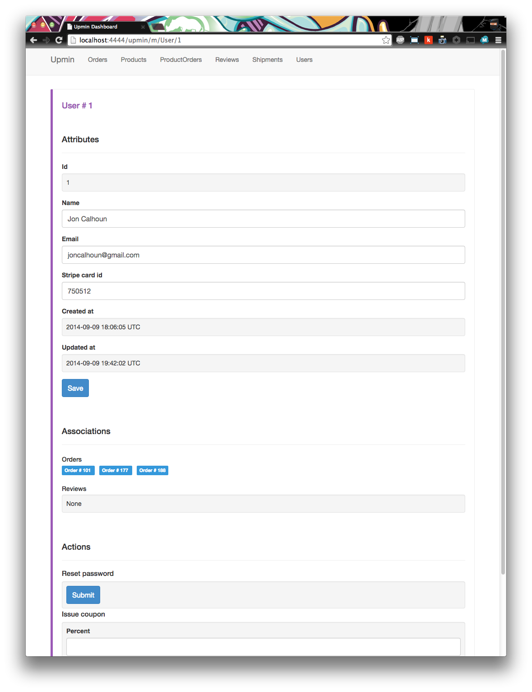
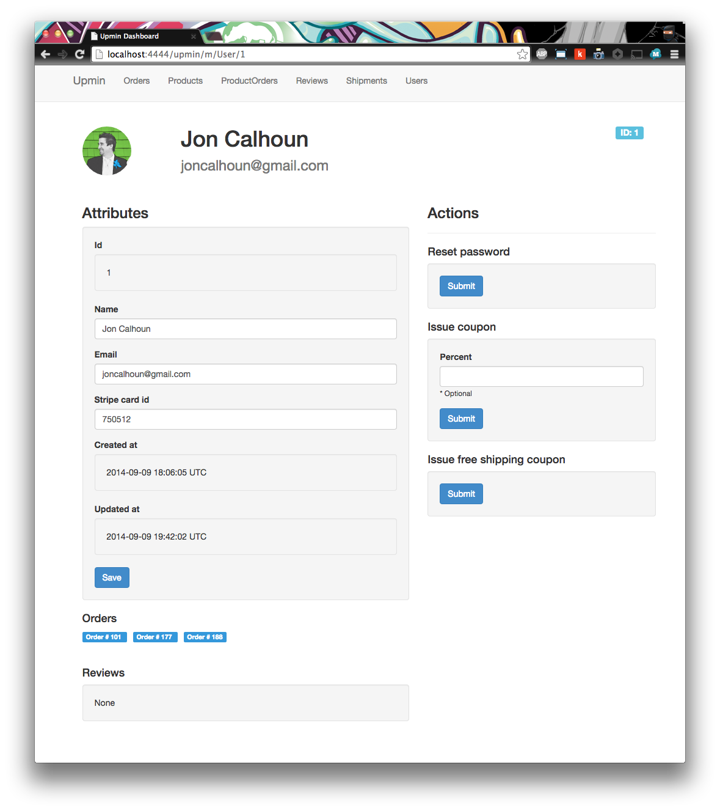
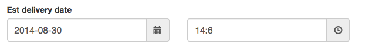

# Customizing Model Views in Upmin Rails

One of the most common things you will want to do in Upmin is customize how models are displayed. Below we cover how to do this and provide a few basic examples to help get you started.

##### Demo Application & Seed Data

This demo uses the [store_demo](https://github.com/upmin/store_demo) repository provided by upmin, but you are welcome to follow along with your own rails application.

If you do choose to use the [store_demo](https://github.com/upmin/store_demo), please follow the directions in the [README](https://github.com/upmin/store_demo/blob/master/README.md) to ensure you have seed data to work with.


## Customizing Views

Customizing views in Upmin is designed to be easiy and familiar. You don't need to learn Arbre or any other new language to create views - you simply edit partials that you are familiar with. By default Upmin uses [Haml](http://haml.info/) but you are free to use **erb**, or whatever else you are familiar with.

Because we will be working with partials, the first thing we need to go over is the directory structure. Upmin expects all model partials to be under the path `app/views/upmin/partials/models`.


### Customizing Model Views

Upmin provides a few helper methods to render models, and these helper methods are what decide which partial to render. For models this helper method is `up_model` and can be found in [render.rb](../lib/upmin/railties/render.rb). This method can be used to render any model. For example, a User model could be rendered by calling `up_model(User.first)` inside of a view. Generally this should only be done in views for admins, not customer facing views.


#### The `up_model` helper method

The `up_model` method takes 2 arguments:

- The model you want to render.
- A hash of options. This argument is not required, but can be used to pass in locals, and declare the partial to be used.

For example, you could use the following in an erb file:

```html
<%= up_model(User.first, as: :mega_user, locals: { dog: "Snoopy" }) %>
```

When `up_model` attempts to render a model, it creates a priority list of partials to try. If a partial does not exist, it simply moves on to the next partial in the list until it has exhausted all options. The priority list is:

1. **options[:as]** - this is the as: option provided in the optional hash for `up_model`, and always takes first priority. For example, `up_model(User.first, as: :mega_user)` would attempt to use the partial `app/views/upmin/partials/models/mega_user`.

2. **model.name.underscore** - this is determined by the model provided as the first argument in `up_model`. For example, `up_model(User.first)` would attempt to use the partial `app/views/upmin/partials/models/user`.

3. **The default `model` partial** - Upmin provides a default partial that can render any model in a generic way. The default partial can be [seen here](../app/views/upmin/partials/models/_model.html.haml) and you can override this by creating your own partial under the directory `app/views/upmin/partials/models/model` in your own applicatoin.


#### Creating a Custom Model Partial

Modifying your own custom partial is simple to do. Simply create the partial you want to customize, and the model object will be passed in with the same name as your partial. For example, the partial `_user.html.haml` would have a `user` object that references the user being rendered. Below is a full list of locals passed into model partials:

- **object** - This is an object with the same name as your partial, and references the model you are trying to render. eg the partial `_user.html.haml` would have a `user` object.

- **upmin_model** - This is an instance of the [Upmin::Model](../lib/upmin/model.rb) class, that contains the model you are trying to render as well as a few helper methods.


For example, in the [store_demo](https://github.com/upmin/store_demo) application the user view is customized from the default view:



And instead is rendered using the `_user.html.erb` partial (see [app/views/upmin/partials/models/_user.html.erb](https://github.com/upmin/store_demo/blob/app/views/upmin/partials/models/_user.html.erb)) for a result of:




### Customizing Attributes

Sometimes you don't need to update an entire model, but instead want to add new attributes, or determine how a specific attribute is rendered.


#### Adding Custom Attributes

The first thing we are going to cover is how to add custom attributes. By default, Upmin uses all attributes associated ot a model. To get a list of these for any model, simply call `ModelName#attribute_names`. For example, a User model's attributes can be viewed with `User.attribute_names`.


To add an individual attribute, you simply need to define a method or accessor as an `upmin_attribute`. For example, if we wanted to add the `total_cost` attribute to our `Order` model we would add the following line of code:

```ruby
class Order < ActiveRecord::Base
  has_many :product_orders
  has_many :products, through: :product_orders
  has_one :shipment
  belongs_to :user

  upmin_attribute :total_cost

  ...

end
```

Notice that the `total_cost` method already existed. Upmin was designed to let developers use existing code rather than writing entirely new classes for admin pages.


If you are going to be adding a lot of attributes, or you want to make sure some default attributes aren't included, this can be achieved with `upmin_attributes` in your model. This will replace the default set of attributes used in upmin with whatever attributes you provide. For example, if you want to limit the attributes shown in the `Product` model you would update the model code to look like:

```ruby
class Product < ActiveRecord::Base
  has_many :product_orders
  has_many :orders, through: :product_orders
  has_many :reviews

  upmin_attributes :name, :short_desc, :price, :manufacturer, :free_shipping

end
```

In this case the only attributes that will be rendered are those included in the `upmin_attributes` list.


#### Customizing Attribute Views

Upmin also provides a helper method to render attributes, and this helper method is what decides which partial to render. For attributes this helper method is `up_attribute` and can be found in [render.rb](../lib/upmin/railties/render.rb). This method can be used to render any model attribute. For example, a User's name could be rendered by calling `up_attribute(User.first, :name)` inside of a view. Generally this should only be done in views for admins, not customer facing views.


#### The `up_attribute` helper method

The `up_attribute` method takes 3 arguments:

- The model you want to render an attribute from
- The name of the attribute you want to render
- A hash of options. This argument is not required, but can be used to pass in:
  - partial locals, specifically many attribute partials will use a form builder if one is provided - `locals: { form_builder: f }`.
  - declare the partial to be used `as: "partial_name"`

For example, you could use the following in an erb file:

```html
<%= form_for(upmin_model.instance, url: upmin_model_path(upmin_model.path_hash), html: { method: :put }) do |f| %>
  <%= up_attribute(User.first, :name, locals: { form_builder: f }) %>
<% end %>
```

When `up_attribute` attempts to render an attribute, it creates a priority list of partials to try. If a partial does not exist, it simply moves on to the next partial in the list until it has exhausted all options. The priority list is:

1. **options[:as]** - this is the as: option provided in the optional hash for `up_attribute`, and always takes first priority. For example, `up_attribute(User.first, :name, as: :h1)` would attempt to use the partial `app/views/upmin/partials/models/h1`.

2. **<model_name>_<attribute_name>** - this is determined by the model provided as the first argument in `up_attribute`, and the attribute name. For example, `up_attribute(User.first, :name)` would attempt to use the partial `app/views/upmin/partials/models/user_name`.

3. **<model_name>_<attribute_type>** - this is determined by the model provided as the first argument in `up_attribute`, and the attribute name. For example, `up_attribute(User.first, :name)` would attempt to use the partial `app/views/upmin/partials/models/user_string` if the `name` attribute is of the type :string. Upmin does its best to determine the type of an attribute but this isn't always perfect. Check the `attribute_type` method in [Upmin::Model](../lib/upmin/model.rb) if you are experiencing an issue, and please file an issue so we can fix it.

4. **<attribute_type>** - this is similar to [3], but isn't specific to the model. This is how strings and datetimes are rendered currently - see [datetime](../app/views/upmin/partials/attributes/_datetime.html.haml) for a more complex example.

5. **The default `unknown` partial** - Upmin provides a default partial that can render any data, but it won't be editable and is just rendered as a string.


#### Creating a Custom Attribute Partial

Modifying your own custom partial is simple to do. Simply create the partial you want to customize, and the model object will be passed in with the same name as your partial. For example, the [datetime](../app/views/upmin/partials/attributes/_datetime.html.haml) partial is used by default to render datetimes with a date and time picker shown below.


